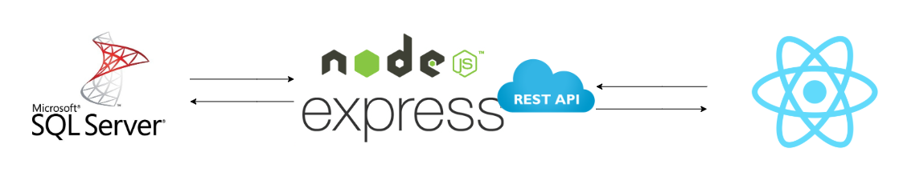
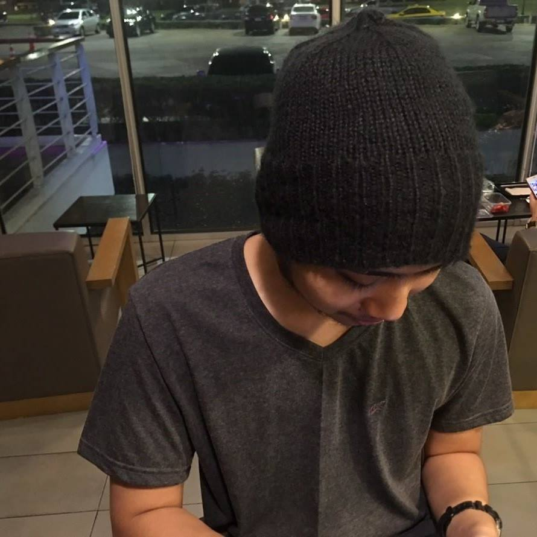

# Meetup 03-02-19 at Joint Space ubon
## Mini workshop

## Utility CSS

   

<h2>Schedule</h2>

   <table style="width:100%">
  <tr>
    <th>Start time</th>
    <th>Topic</th> 
    <th>Speaker</th>
  </tr>
  <tr>
    <td>10.00 AM - 11.00 AM</td>
    <td>SQL server</td> 
    <td>
        
        Paramat Singkon
    </td>
  </tr>
  <tr>
    <td>11.00 AM - 12.00 PM</td>
    <td>Nodejs</td> 
     <td>
        
        Jirayuth Sing-ngam
    </td>
  </tr>
  <tr>
    <td>13.30 PM - 14.30 PM</td>
    <td>React</td> 
     <td>
        
        Nuttawat Sritunyarat
    </td>
  </tr>
  <tr>
    <td>14.30 PM - 15.30 PM</td>
    <td>Utility CSS</td> 
    <td>
        
        Thanapong Prathumchat
    </td>
  </tr>
</table>

   

<h2>Requirement for workshop</h2>
<ul>
    <li>Your labtop MacOs/Window/Linux</li>
    <li>Docker Engine</li>
</ul>
